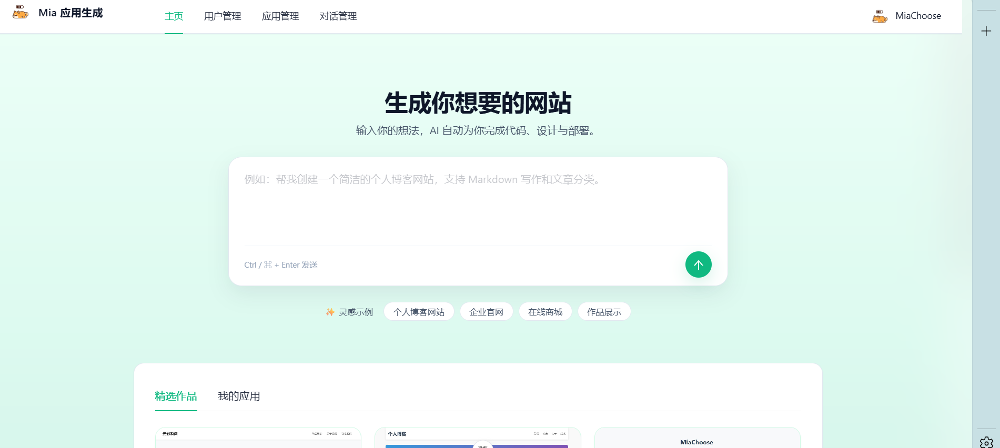

首页


# Mia 应用生成

「Mia 应用生成」前端 —— 基于 Vue 3 + TypeScript + Vite 构建

## 一、技术栈

### 核心
| 类别 | 选型 | 版本 |
| --- | --- | --- |
| 框架 | Vue | ^3.5.17 |
| 语言 | TypeScript | ~5.8 |
| 构建 | Vite | ^7.0 |
| 路由 | Vue Router | ^4.5 |
| 状态 | Pinia | ^3.0 |
| UI | Ant Design Vue | ^4.2 |
| HTTP | Axios | ^1.13 |
| Markdown | markdown-it + highlight.js | ^14.1 / ^11.11 |

## 二、目录结构

<!-- TOC_PLACEHOLDER -->

```
AI-zero-code-generation-front
├── public/                    # 静态资源（不参与打包处理）
├── src/
│   ├── api/                   # OpenAPI 自动生成的请求层（勿手改）
│   │   ├── *Controller.ts     # 各业务模块（user / app / chat / workflow ...）
│   │   ├── typings.d.ts       # declare namespace API：所有 DTO 类型
│   │   └── index.ts           # controller 聚合
│   ├── assets/                # 图片、字体等
│   ├── components/            # 复用组件（AppCard / Header / Footer / Modal ...）
│   ├── config/                # 环境与常量（env.ts 集中读取 import.meta.env）
│   ├── layouts/               # BasicLayout：薄荷渐变 + 半透明白罩
│   ├── pages/                 # 业务页面（按域分目录）
│   │   ├── HomePage.vue       # Hero 输入 + Tab 切换
│   │   ├── user/              # 登录 / 注册 / 个人资料
│   │   ├── admin/             # 用户 / 应用 / 对话管理
│   │   └── app/               # 应用对话页 + 编辑页
│   ├── router/                # 全部静态首页 + 其余懒加载路由
│   ├── stores/                # Pinia Setup Store（loginUser）
│   ├── styles/                # tokens.css 全局设计令牌
│   ├── utils/                 # 工具函数
│   ├── access.ts              # 路由前置守卫 + 权限判定
│   ├── App.vue                # 根组件，挂载 ConfigProvider
│   ├── main.ts                # 入口（Pinia / Router / Antd / tokens）
│   └── request.ts             # Axios 实例 + 统一拦截器
├── .env.development           # 开发环境变量
├── .env.production            # 生产环境变量
├── openapi2ts.config.ts       # OpenAPI 转 TS 配置
├── vite.config.ts             # 构建配置（含 manualChunks 拆分）
├── tsconfig.json              # TS 引用配置
└── package.json
```

## 三、快速启动

### 1. 环境
- Node.js ≥ 20（推荐 22，与 `@tsconfig/node22` 对齐）
- 包管理器：npm / pnpm 任一

### 2. 安装依赖
```bash
npm install
```

### 3. 配置环境变量
开发环境读取 `.env.development`：
```bash
VITE_API_BASE_URL=/api                        # 走 Vite 代理，避免跨域 Cookie 丢失
VITE_DEPLOY_DOMAIN=http://localhost:8123/api/static
```
生产环境改用 `.env.production`。

### 4. 常用命令

| 命令 | 作用 |
| --- | --- |
| `npm run dev` | 启动开发服务器（默认 5173） |
| `npm run build` | type-check 并构建生产产物（并行） |

## 四、核心功能模块

### 4.1 状态管理（`src/stores/loginUser.ts`）
Pinia Setup Store，仅维护登录用户。`fetchLoginUser` 返回 `Promise<boolean>`：成功（含已确认未登录）返回 `true`，请求异常返回 `false`，便于守卫重试。

```ts
const { loginUser, fetchLoginUser, setLoginUser } = useLoginUserStore()
```

### 4.2 权限控制（`src/access.ts`）
路由前置守卫 + 模块级 `loginStateResolved` 标志：
- 首屏首次导航时 `await fetchLoginUser()`，仅在成功时才置位标志，失败下次仍会重试
- 路径前缀 `/admin` 要求 `userRole === 'admin'`，否则跳登录页并附 `redirect`
- 配合 `request.ts` 拦截器对 `code === 40100` 的二级兜底，形成「守卫 + 拦截器」双重防线

### 4.3 请求层（`src/request.ts`）
Axios 实例 + 全局拦截器，统一处理业务错误：
- `baseURL` = `VITE_API_BASE_URL`（默认 `/api`，dev 由 Vite 代理转发到后端）
- `withCredentials: true`，依赖会话 Cookie
- `timeout: 60000`
- 响应拦截器规则：
  - `code === 0`：放行
  - `code === 40100`：跳转登录页（跳过 `user/get/login` 自身请求）
  - 其余非 0：统一 `message.error(data.message)`
  - HTTP 非 2xx：统一 `message.error('网络异常 (xxx)')`
- 任意请求可传 `skipErrorHandler: true` 关闭统一提示，自行处理（用于表单内联报错等）

```ts
import request from '@/request'
await request('/foo', { method: 'POST', data, skipErrorHandler: true })
```

### 4.4 路由（`src/router/index.ts`）
- `HomePage` 静态导入（首屏）
- 其余 8 个页面（`user/*`、`admin/*`、`app/*`）`() => import(...)` 懒加载
- 中文 `name` 字段直接复用为面包屑/菜单标题

### 4.5 设计令牌（`src/styles/tokens.css`）
全局 CSS 变量：色板（主色 `#10B981`）、字号阶梯、4px 栅格间距、圆角、阴影、薄荷渐变。配合 `App.vue` 的 `<a-config-provider>` 把 antd 主题锁死成同一套令牌。修改主色只需改 `--color-primary` + `colorPrimary`。

### 4.6 业务页面
| 页面 | 路径 | 说明 |
| --- | --- | --- |
| 主页 | `/` | Hero 输入框（6 行 textarea + Ctrl/⌘+Enter 发送）+ 灵感 chip + Tab 切换（精选 / 我的） |
| 应用对话 | `/app/chat/:id` | 两段式：左 ChatGPT 气泡对话 + 右 iframe 预览，支持下载代码 / 部署 / 可视化编辑 |
| 应用编辑 | `/app/edit/:id` | 修改应用名 / 封面 / 优先级（管理员） |
| 用户 | `/user/login` `/user/register` `/user/modify` | 480 宽白卡 |
| 管理 | `/admin/{userManage,appManage,chatManage}` | 白卡 + 浅薄荷行 hover 表格 |

### 4.7 关键组件
- `AppCard` —— 应用卡片，hover 显示「查看对话 / 查看作品」
- `MarkdownRenderer` —— `defineAsyncComponent` 懒加载，把 markdown-it + highlight.js 拆到独立 chunk
- `AppDetailModal` / `DeploySuccessModal` —— 详情与部署成功弹窗
- `GlobalHeader` / `GlobalFooter` —— 全站壳

## 五、构建与部署

### 6.1 构建产物分块策略
`vite.config.ts` 通过 `rollupOptions.output.manualChunks` 把第三方库切成独立 vendor chunk：
```ts
manualChunks: {
  'vendor-vue':      ['vue', 'vue-router', 'pinia'],
  'vendor-antd':     ['ant-design-vue', '@ant-design/icons-vue'],
  'vendor-markdown': ['markdown-it', 'highlight.js'],
}
```
- vendor 体积大、变更少 → 浏览器长缓存
- 业务代码迭代不会让 vendor hash 失效
- `MarkdownRenderer` 异步加载，仅进入对话页时下载

### 6.2 构建
```bash
npm run build       # type-check 与构建并行
# 产物输出到 dist/
```

### 6.3 预览
```bash
npm run preview     # 本地起静态服务预览 dist/
```

### 6.4 部署
- 产物为纯静态资源，可托管到 Nginx / OSS / Vercel / GitHub Pages 等任意静态服务
- 由于使用 HTML5 History 路由，需配置 fallback 把所有未匹配路径重写到 `index.html`
- Nginx 示例：
  ```nginx
  location / {
    try_files $uri $uri/ /index.html;
  }
  location /api/ {
    proxy_pass http://backend:8123/api/;
    proxy_set_header Host $host;
    proxy_set_header X-Real-IP $remote_addr;
  }
  ```
- 生产环境记得修改 `.env.production` 中的 `VITE_API_BASE_URL` 与 `VITE_DEPLOY_DOMAIN`

### 6.5 后端联调
1. 启动后端 `http://localhost:8123`
2. `npm run dev`，Vite 自动把 `/api/*` 代理到后端，浏览器无跨域
3. 后端接口变更后跑 `npm run openapi2ts` 同步类型与方法

## 七、规范

### 代码风格
- ESLint Flat Config（`eslint.config.ts`）：Vue Essential + TS Recommended + Prettier 兼容
- Prettier：无分号、单引号、`printWidth: 100`
- `npm run lint` 修复，`npm run format` 强制格式化 `src/`


